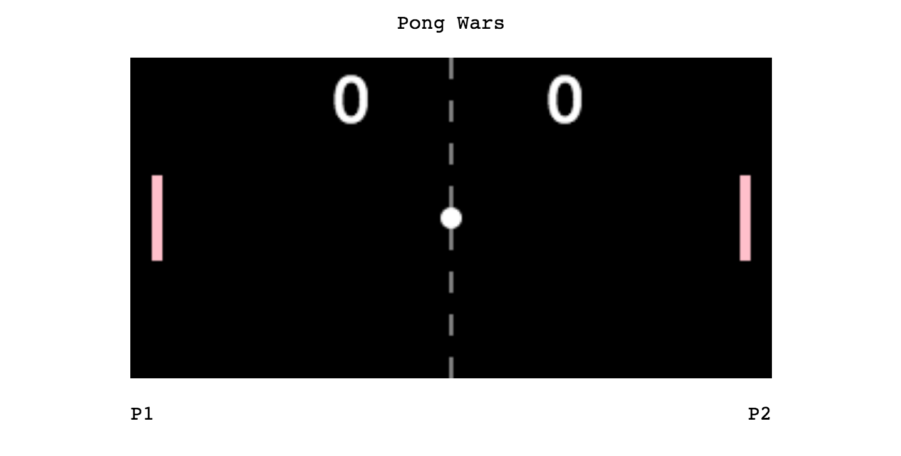

#Project 3: A Pong Game
Project 3 at RED introduced us to Javascript ES6 syntax and Webpack as a build tool in relation to game coding.

##About the Pong Game
This is a working game of Pong:
###How to Play:
####Keys

#####Player 1:
* a: up 
* z: down

#####Player 2:
* ▲ : up
* ▼: down

##### Start
* spacebar: start ball movement
-------------

###Technology Used
* HTML5 Canvas
* ES2015
* Webpack as a build tool
* SASS

##Meaningful Takeaways

My third project for REDAcademy involved creating a basic pong game using HTML5 Canvas and Javascript's ES2015 syntax. This was a very interesting challenge, as it was part code along with the class, and part figure out the missing pieces. I thought it was a great opportunity to use the new syntax for ES2016 and practice a more object oriented programming style with the newly added class functionality.

I have found through my first few projects here at RED that I really enjoy setting up the best dev environment that I can. I enjoy using/learning all the tools to utilize for being able to write more readable code on my end, while still producing files the browser can still read and render.

I learned a lot from completing this project. It challenged my problem-solving abilities and also really opened up my eyes to how precisely you need to be when telling a computer what to do.

